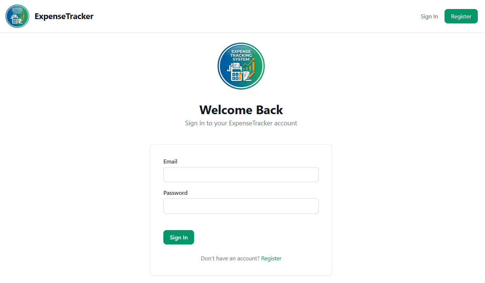
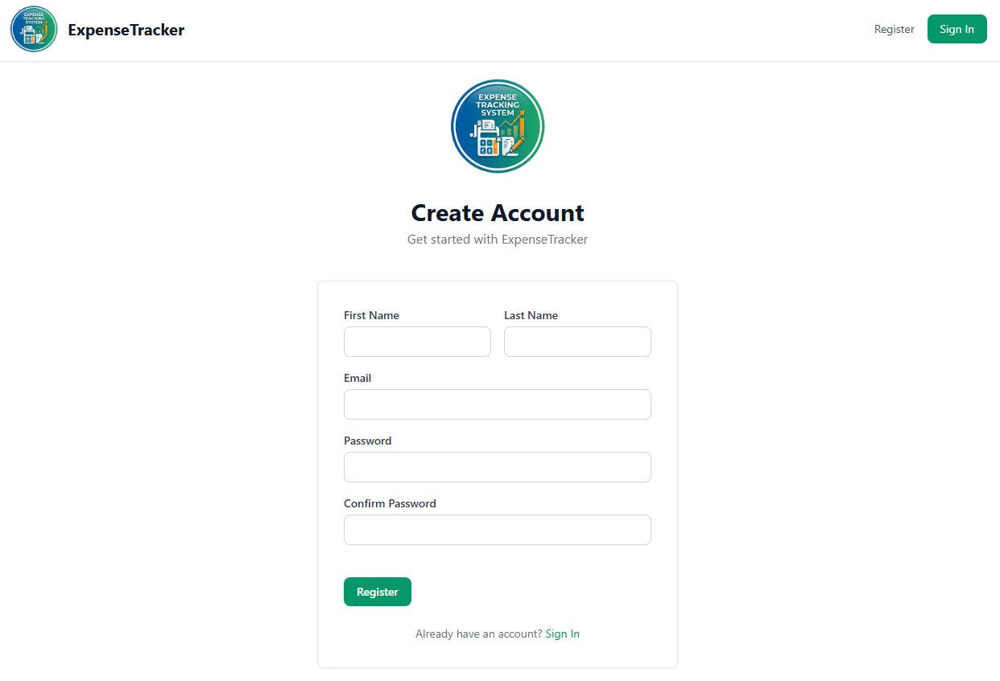
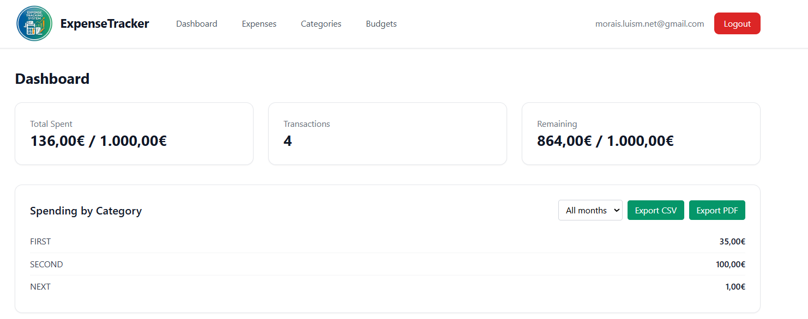
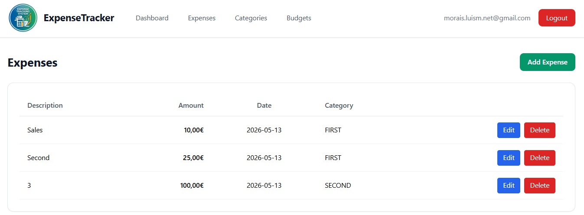
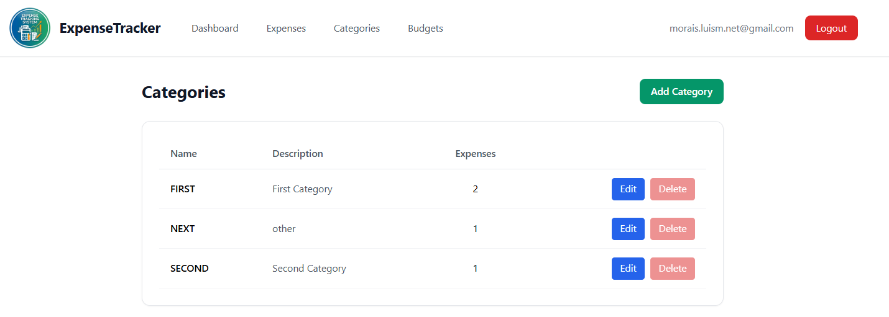
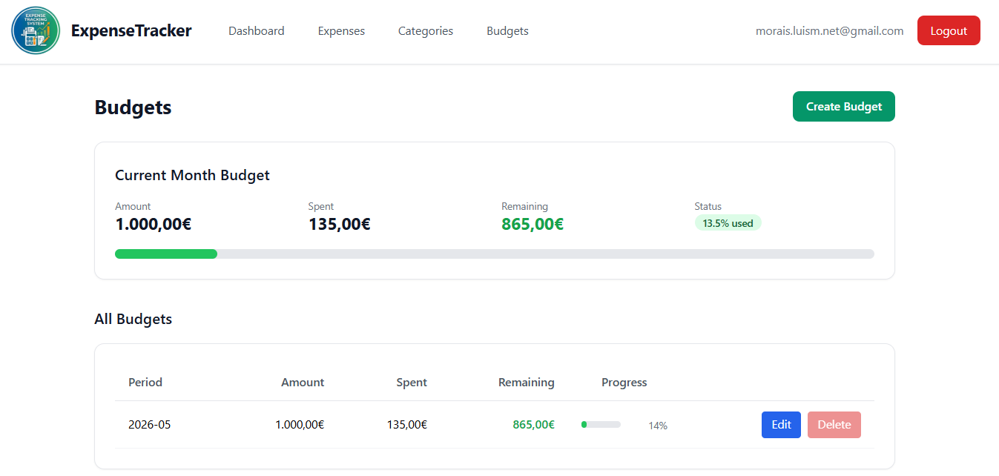

# ExpenseTrackingSystemAngular

Angular 20 frontend for the Expense Tracking System — a full-featured personal finance manager with dashboard, expense tracking, budget management, and category organization.

## Features

- **Dashboard** — Overview with total spent, transaction count, remaining budget, and spending breakdown by category. Export data as CSV or PDF (filterable by month).
- **Expense Management** — Add, edit, delete expenses with inline delete confirmation. View in a sortable table with amount, date, and category.
- **Category Management** — Create and manage expense categories with automatic expense count tracking. Delete protection when expenses exist.
- **Budget Management** — Set monthly budgets with real-time spending and remaining amounts. Delete protection when budget has funds allocated.
- **Authentication** — Register, login, and JWT-based session management with guarded routes.
- **Export** — Download expenses as CSV or PDF files with optional month filtering.
- **Responsive UI** — Tailwind CSS design that works on desktop and mobile.

## Technologies Used

| Technology | Version |
|---|---|
| **Angular** | 20.3 |
| **TypeScript** | 5.9 |
| **Tailwind CSS** | 3.4 |
| **RxJS** | 7.8 |
| **Karma + Jasmine** | (testing) |

### Shared Components

| Component | Usage |
|---|---|
| `NavbarComponent` | Sticky top navigation with auth-aware links |
| `CardComponent` | White rounded shadow card container |
| `ButtonComponent` | Primary/secondary/danger variants with loading state |
| `StatusBadgeComponent` | Color-coded status pill (green/yellow/red/blue/gray) |
| `LoadingSpinnerComponent` | Centered animated SVG spinner |
| `InputComponent` | Labeled input field (text/number/email/password/date) |

### Pipe

| Pipe | Description |
|---|---|
| `CurrencyFormatPipe` | European format: `.` thousand separator, `,` decimal, `€` after amount |

## Project Structure

```
src/
├── index.html
├── main.ts
├── styles.css                      # Tailwind directives
├── environments/
│   └── environment.ts              # API URL config
└── app/
    ├── app.ts                      # Root component
    ├── app.config.ts               # Providers (router, http, interceptor)
    ├── app.routes.ts               # Route definitions
    ├── core/
    │   ├── guards/
    │   │   └── auth.guard.ts       # Auth guard
    │   ├── interceptors/
    │   │   └── auth.interceptor.ts # JWT Bearer token injection
    │   ├── models/
    │   │   └── api.models.ts       # TypeScript interfaces for all DTOs
    │   └── services/
    │       ├── auth.service.ts     # Authentication + token management
    │       ├── expense.service.ts  # Expenses CRUD + summary + months
    │       ├── category.service.ts # Categories CRUD
    │       ├── budget.service.ts   # Budgets CRUD + current
    │       └── export.service.ts   # CSV/PDF download
    ├── features/
    │   ├── auth/
    │   │   ├── login/login.ts
    │   │   └── register/register.ts
    │   ├── dashboard/dashboard.ts
    │   ├── expenses/expenses-list/expenses-list.ts
    │   ├── categories/categories-list/categories-list.ts
    │   └── budgets/budgets-list/budgets-list.ts
    └── shared/
        ├── components/
        │   ├── navbar/navbar.ts
        │   ├── card/card.ts
        │   ├── button/button.ts
        │   ├── status-badge/status-badge.ts
        │   ├── loading-spinner/loading-spinner.ts
        │   └── input/input.ts
        └── pipes/
            └── currency-format.ts
```

## Screenshots

<kbd></kbd>  <kbd></kbd>  <kbd></kbd>
<kbd></kbd>  <kbd></kbd>  <kbd></kbd>

## Requirements

- [Node.js](https://nodejs.org/) 18+
- [Angular CLI](https://angular.dev/cli) 20.x (`npm install -g @angular/cli`)
- Backend API running at `http://localhost:5144`

## Getting Started

```bash
# Install dependencies
npm install

# Start development server (opens browser at http://localhost:4200)
npm start

# Or manually
ng serve --open
```

The app connects to the backend API at `http://localhost:5144/api` (configured in `src/environments/environment.ts`).

## Build

```bash
npm run build
```

Production build outputs to `dist/expense-tracking-system-angular/`.

## Test

```bash
npm test
```

Runs Karma + Jasmine unit tests.

## UI Notes

- **Currency format**: European convention — `.` as thousands separator, `,` as decimal separator, `€` appended after the amount (e.g., `1.234,56€`)
- **Delete confirmation**: Inline "Delete? Yes / No" buttons instead of browser dialogs
- **Navbar behavior**: Links become plain text when on their own page
- **Button styling**: Edit = blue background, Delete = red background (disabled when conditions aren't met)
- **Budget delete**: Disabled when `amount > 0` or `remainingAmount > 0`
- **Category delete**: Disabled when `expenseCount != 0`
- **Export**: Month selector only shows months that have expense data

---

[DeepWiki moraisLuismNet/ExpenseTrackingSystemAngular](https://deepwiki.com/moraisLuismNet/ExpenseTrackingSystemAngular)
